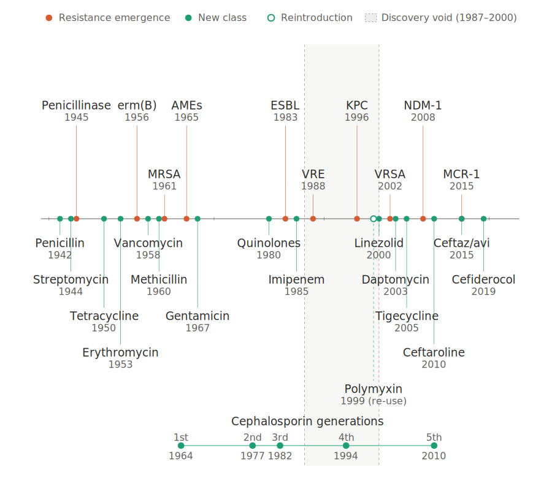

## Antibiotics for MDR Pathogens in Advanced Stages <br> of Clinical Development {background-video="/images-new-abx/molecules.mp4" background-video-loop="true" background-video-muted="true" background-color="#b20e10" background-opacity="0.3"}

<br>

<br>

<br> <br>

<center>

**Russell E. Lewis, Pharm.D., FCCP** <br> Associate Professor of Infectious Diseases <br>

<center>

{fig-align="center" width="350"}

<br>  russelledward.lewis\@unipd.it <br>  [https://github.com/Russlewisbo](https://github.com/Russlewisbo/ESCMID_2022_talk) <br> Slides and course materials: [www.idpadova.com](https://padovaid.com/)

# Part 1: The AMR Crisis and Priority Pathogens {background-color="#b20e10"}

## Antibiotic development vs. resistance {.smaller}

{fig-align="center" width="650"}

## The antimicrobial resistance crisis

<br>

:::: columns
::: {.column width="50%"}
**Current Impact:**

- **700,000** deaths annually attributed to AMR
- MDR organisms have limited treatment options
- Resistance detected after every new antibiotic introduction

**Projected Impact:**

- **10 million deaths/year** by 2050 if unchecked
- Economic burden estimated at \$100 trillion
:::
::::

::: aside
The discovery of penicillin in 1928 marked the dawn of the antibiotic era. However, by 1942, penicillin resistance among Staphylococcus aureus was already reported. This pattern has repeated with every new antimicrobial agent introduced.
:::

## Legislative Efforts: <br> The GAIN Act (2012) and Italian Progress

<br>

**Generating Antibiotic Incentives Now Act** provided "push incentives":

| Incentive              | Mechanism                            |
|:-----------------------|:-------------------------------------|
| Extended exclusivity   | Additional 5 years market protection |
| Fast track designation | Accelerated development pathway      |
| Priority review        | 6-month vs. 10-month FDA review      |

::: callout-note
## Results: 2010-2020

<br> **17 new systemic antibiotics** approved, including agents targeting CRE and MRSA
:::

<br>

- **Italy:** (Legge di Bilancio 2025), specifically Article 49 - allowed certain WHO AWaRe “Reserve” antibiotics targeting multidrug-resistant organisms to access the national Innovative Medicines Fund
- Created access to up to €100 million annually for qualifying reserve antibiotics
- Linked reimbursement to therapeutic innovativeness and stewardship monitoring
- Attempted to delink company revenue from antibiotic sales volume, thereby encouraging development of new antimicrobials

## The Plazomicin case study: A cautionary tale

::::: columns
::: {.column width="50%"}
{width="350"}
:::

::: {.column width="50%"}
<br> <br>

**Timeline:**

- FDA approval obtained for new aminoglycoside targeting resistant gram-negatives
- Drug reserved as "last resort" therapy (appropriate stewardship)
- Low sales volume due to targeted use
- **Company could not sustain itself financially**
- **The lesson:** Push incentives support development but fail to ensure **post-approval sustainability**
- **New focus:** Pull incentives (subscription models) that reward societal value rather than sales volume
:::
:::::

::: aside
This case perfectly illustrates the paradox of antibiotic development - we need these drugs to be available but want them used sparingly. Subscription-based payment models, like those being piloted in the UK and proposed in US legislation like PASTEUR Act, may help address this market failure.
:::

## WHO Priority Pathogens List (2024 Update)

<br>

**Assessment criteria (MCDA framework):**

1.  Mortality & non-fatal burden
2.  Incidence & 10-year resistance trends
3.  Transmissibility & preventability
4.  Treatability & antibacterial pipeline

**Key changes from 2017:**

- Rifampicin-resistant *M. tuberculosis* added to critical tier
- *Salmonella* Typhi & *Shigella* spp. elevated to high priority
- *P. aeruginosa* reclassified from critical → high
- *H. pylori*, *Campylobacter* spp. removed

<br> <br>

::: aside
The WHO updated this list in 2024 [@Sati2025], covering 24 pathogens across 15 families. The MCDA framework scored pathogens on 8 criteria, weighted by a survey of 79 international experts. The top-ranked bacterium was carbapenem-resistant K. pneumoniae (84%) and the bottom-ranked was penicillin-resistant group B streptococci (28%).
:::

## Critical priority pathogens

<br>

| Pathogen | Resistance Pattern |
|:--------------------------------------|:--------------------------------|
| *Acinetobacter baumannii* | Carbapenem-resistant (CRAB) |
| Enterobacterales (*K. pneumoniae*, *E. coli*, others) | Carbapenem-resistant (CRE) |
| Enterobacterales (*K. pneumoniae*, *E. coli*, others) | 3rd-generation cephalosporin-resistant (ESBL) |
| *Mycobacterium tuberculosis* | Rifampicin-resistant |

<br>

::: fragment
**Novel agents covered in this lecture:** Sulbactam-durlobactam (CRAB), multiple BL/BLI combinations & oral carbapenems (CRE/ESBL)
:::

::: aside
These pathogen groups represent the most urgent need for new antibiotics. Carbapenem-resistant K. pneumoniae scored highest overall at 84%. The 2024 list separates 3rd-gen cephalosporin-resistant Enterobacterales from carbapenem-resistant Enterobacterales to highlight their distinct challenges. Rifampicin-resistant M. tuberculosis was added after an independent parallel analysis.
:::

## High priority pathogens

<br>

| Pathogen | Resistance Pattern |
|:---|:---|
| *Salmonella enterica* serotype Typhi | Fluoroquinolone-resistant |
| *Shigella* spp. | Fluoroquinolone-resistant |
| *Enterococcus faecium* | Vancomycin-resistant (VRE) |
| *Pseudomonas aeruginosa* | Carbapenem-resistant |
| Non-typhoidal *Salmonella* | Fluoroquinolone-resistant |
| *Neisseria gonorrhoeae* | 3rd-gen cephalosporin- and/or FQ-resistant |
| *Staphylococcus aureus* | Methicillin-resistant (MRSA) |

<br> <br>

::: fragment
**Novel agents covered:** Ceftobiprole (MRSA), Gepotidacin & Zoliflodacin (*N. gonorrhoeae*)
:::

## Medium priority pathogens

<br>

| Pathogen                   | Resistance Pattern   |
|:---------------------------|:---------------------|
| Group A streptococci       | Macrolide-resistant  |
| *Streptococcus pneumoniae* | Macrolide-resistant  |
| *Haemophilus influenzae*   | Ampicillin-resistant |
| Group B streptococci       | Penicillin-resistant |

<br> <br>

::: fragment
These pathogens have a disproportionate impact on infants, young adults,<br> and older adults, especially in resource-limited settings.
:::

::: aside
Community-acquired pathogens such as Salmonella typhi and Shigella were elevated to high priority due to large disease burden and increasing resistance, particularly in LMICs. Medium-priority pathogens reflect the importance of vaccine coverage and prevention strategies.
:::

## β-Lactamase classification: Ambler system

<br>

| Class | Type | Examples | Inhibited by |
|:----------------|:----------------|:----------------|:--------------------|
| **A** | Serine | KPC, CTX-M, TEM, SHV | Avibactam, Vaborbactam, Xeruborbactam |
| **B** | Metallo (MBL) | NDM, VIM, IMP | Aztreonam stability only; Xeruborbactam, Taniborbactam |
| **C** | Serine (AmpC) | AmpC | Avibactam, Xeruborbactam |
| **D** | Serine (OXA) | OXA-23, OXA-48 | Durlobactam, Avibactam (limited), Xeruborbactam |

<br> <br>

::: callout-important
## Critical Point

<br> **Class B MBLs** remain the greatest challenge - no approved inhibitor exists, but taniborbactam and xeruborbactam are in development
:::

::: aside
Understanding β-lactamase classification is essential for selecting appropriate BL/BLI combinations. The Ambler classification divides these enzymes into 4 classes. Class B metallo-β-lactamases are particularly problematic because they require zinc for activity and current inhibitors don't work against them - with one important exception we'll discuss.
:::

## Novel β-Lactamase inhibitor classes

<br>

::::: columns
::: {.column width="50%"}
**Diazabicyclooctanes (DBOs):**

- Avibactam
- Relebactam
- **Durlobactam** (OXA activity!)
- Zidebactam

**Mechanism:** Covalent, reversible binding to serine β-lactamases
:::

::: {.column width="50%"}
**Boronates:**

- Vaborbactam
- **Taniborbactam** (MBL activity!)
- **Xeruborbactam** (ultra-broad spectrum!)

**Mechanism:** Reversible binding, broader spectrum including some MBLs
:::
:::::

:::: fragment
::: callout-tip
## Key Innovation

<br> Taniborbactam and xeruborbactam are the first inhibitors with activity against **Class B metallo-β-lactamases** (NDM, VIM); xeruborbactam also inhibits IMP
:::
::::

::: aside
The development of new β-lactamase inhibitor classes has been crucial for addressing carbapenemase-producing organisms. The DBOs and boronates represent significant advances over older inhibitors like clavulanate and tazobactam.
:::

## Chapter roadmap: Agents we'll cover

<br>

::::::::::: columns
:::: {.column width="30%"}
::: {style="background-color: #dbeafe; border-left: 4px solid #2563eb; border-radius: 6px; padding: 12px 14px;"}
**🔵 β-Lactam/BLI**

- Sulbactam-Durlobactam
- Aztreonam-Avibactam
- Cefepime-Enmetazobactam
- Cefepime-Taniborbactam
- Cefepime-Zidebactam
- Meropenem-Xeruborbactam
:::
::::

:::: {.column width="22%"}
::: {style="background-color: #fef9c3; border-left: 4px solid #ca8a04; border-radius: 6px; padding: 12px 14px;"}
**🟡 Oral Carbapenems**

- Tebipenem
- Sulopenem
:::
::::

:::: {.column width="22%"}
::: {style="background-color: #f3e8ff; border-left: 4px solid #9333ea; border-radius: 6px; padding: 12px 14px;"}
**🟣 Gram-Positive**

- Ceftobiprole
- Contezolid
- Afabicin
:::
::::

:::: {.column width="22%"}
::: {style="background-color: #dcfce7; border-left: 4px solid #16a34a; border-radius: 6px; padding: 12px 14px;"}
**🟢 Topoisomerase**

- Gepotidacin
- Zoliflodacin
:::
::::
:::::::::::

# Part 2: β-Lactam/ <br>β-Lactamase Inhibitor Combinations {background-color="#b20e10"}

## Sulbactam-Durlobactam (Xacduro™)

<br>

**FDA Approved: May 2023** for HABP/VABP due to *A. baumannii-calcoaceticus* complex. Not approved in Italy (yet) but can be requested by emergency authorization.

::::: columns
::: {.column width="50%"}
**Sulbactam:**

- Historically a β-lactamase inhibitor
- **Intrinsic activity** against *A. baumannii*
- Binds PBP 1a/1b and PBP3
- Limited by contemporary resistance
:::

::: {.column width="50%"}
**Durlobactam:**

- Novel DBO inhibitor
- Inhibits Class A, C, and D enzymes
- **Unique OXA family activity**
- Direct antibacterial activity via PBP2
:::
:::::

:::: fragment
::: callout-tip
## Why This Matters

<br> OXA-type carbapenemases (OXA-23, OXA-24/40) are the **predominant resistance mechanism** in *A. baumannii* worldwide
:::
::::

::: aside
Sulbactam-durlobactam is specifically designed for Acinetobacter infections. What makes durlobactam unique among DBO inhibitors is its potent activity against OXA-type carbapenemases, which are the main resistance mechanism in A. baumannii. This is something that avibactam and relebactam cannot do effectively.
:::

## SUL-DUR: Mechanism of action

<br>

```{=html}
<svg viewBox="0 0 900 390" xmlns="http://www.w3.org/2000/svg" font-family="'Jost', Helvetica, Arial, sans-serif" style="max-width:860px; margin:0 auto; display:block;">
  <defs>
    <marker id="arrBlue" markerWidth="10" markerHeight="7" refX="9" refY="3.5" orient="auto">
      <polygon points="0 0, 10 3.5, 0 7" fill="#3b82f6"/>
    </marker>
    <marker id="arrTeal" markerWidth="10" markerHeight="7" refX="9" refY="3.5" orient="auto">
      <polygon points="0 0, 10 3.5, 0 7" fill="#14b8a6"/>
    </marker>
    <marker id="arrTealD" markerWidth="10" markerHeight="7" refX="9" refY="3.5" orient="auto">
      <polygon points="0 0, 10 3.5, 0 7" fill="#14b8a6" opacity="0.5"/>
    </marker>
  </defs>

  <!-- ===== LEFT: Drug boxes ===== -->
  <rect x="30" y="50" width="155" height="52" rx="10" fill="#3b82f6"/>
  <text x="108" y="82" text-anchor="middle" fill="#fff" font-weight="600" font-size="17">Sulbactam</text>

  <rect x="30" y="148" width="155" height="52" rx="10" fill="#14b8a6"/>
  <text x="108" y="180" text-anchor="middle" fill="#fff" font-weight="600" font-size="17">Durlobactam</text>

  <!-- ===== CENTRE: A. baumannii cell wall (PBPs) ===== -->
  <rect x="275" y="15" width="230" height="230" rx="14" fill="#eff6ff" stroke="#93c5fd" stroke-width="2"/>
  <text x="390" y="42" text-anchor="middle" fill="#1e40af" font-weight="700" font-size="13" font-style="italic">A. baumannii</text>
  <text x="390" y="57" text-anchor="middle" fill="#1e40af" font-weight="600" font-size="12">Cell Wall Targets</text>

  <rect x="300" y="72" width="180" height="36" rx="8" fill="#bfdbfe"/>
  <text x="390" y="96" text-anchor="middle" fill="#1e3a8a" font-weight="500" font-size="14">PBP 1a / 1b</text>

  <rect x="300" y="122" width="180" height="36" rx="8" fill="#bfdbfe"/>
  <text x="390" y="146" text-anchor="middle" fill="#1e3a8a" font-weight="500" font-size="14">PBP 2</text>

  <rect x="300" y="172" width="180" height="36" rx="8" fill="#bfdbfe"/>
  <text x="390" y="196" text-anchor="middle" fill="#1e3a8a" font-weight="500" font-size="14">PBP 3</text>

  <!-- ===== RIGHT: β-Lactamases ===== -->
  <rect x="630" y="15" width="245" height="230" rx="14" fill="#fef2f2" stroke="#fca5a5" stroke-width="2"/>
  <text x="753" y="42" text-anchor="middle" fill="#991b1b" font-weight="700" font-size="14">β-Lactamases</text>
  <text x="753" y="57" text-anchor="middle" fill="#991b1b" font-weight="500" font-size="11">(resistance enzymes)</text>

  <rect x="658" y="72" width="190" height="36" rx="8" fill="#fecaca"/>
  <text x="753" y="96" text-anchor="middle" fill="#7f1d1d" font-weight="600" font-size="13">OXA-23 / 24 / 40</text>

  <rect x="658" y="122" width="190" height="36" rx="8" fill="#fecaca"/>
  <text x="753" y="146" text-anchor="middle" fill="#7f1d1d" font-weight="500" font-size="13">AmpC (Class C)</text>

  <rect x="658" y="172" width="190" height="36" rx="8" fill="#fecaca"/>
  <text x="753" y="196" text-anchor="middle" fill="#7f1d1d" font-weight="500" font-size="13">TEM / SHV (Class A)</text>

  <!-- ===== ARROWS: Sulbactam → PBP1 & PBP3 ===== -->
  <line x1="185" y1="66" x2="298" y2="86" stroke="#3b82f6" stroke-width="2.5" marker-end="url(#arrBlue)"/>
  <line x1="185" y1="86" x2="298" y2="188" stroke="#3b82f6" stroke-width="2.5" marker-end="url(#arrBlue)"/>

  <!-- ===== ARROW: Durlobactam dashed → PBP2 (secondary activity) ===== -->
  <line x1="185" y1="168" x2="298" y2="140" stroke="#14b8a6" stroke-width="2" stroke-dasharray="7,4" opacity="0.5" marker-end="url(#arrTealD)"/>

  <!-- ===== DURLOBACTAM → ALL β-LACTAMASES (routed below both boxes) ===== -->
  <!-- Main trunk: right from drug box → down to y=280 → across below both boxes → up to trunk at x=618 -->
  <path d="M185,180 L230,180 L230,280 L618,280 L618,90"
        fill="none" stroke="#14b8a6" stroke-width="2.5"/>
  <!-- Branch to OXA (top enzyme) -->
  <line x1="618" y1="90" x2="656" y2="90" stroke="#14b8a6" stroke-width="2.5" marker-end="url(#arrTeal)"/>
  <!-- Branch to AmpC (middle enzyme) -->
  <line x1="618" y1="140" x2="656" y2="140" stroke="#14b8a6" stroke-width="2.5" marker-end="url(#arrTeal)"/>
  <!-- Branch to TEM/SHV (bottom enzyme) -->
  <line x1="618" y1="190" x2="656" y2="190" stroke="#14b8a6" stroke-width="2.5" marker-end="url(#arrTeal)"/>

  <!-- "inhibits" label on horizontal segment (with white knockout so line doesn't show through) -->
  <rect x="370" y="269" width="80" height="22" rx="4" fill="#fff"/>
  <rect x="370" y="269" width="80" height="22" rx="4" fill="#14b8a6" opacity="0.12"/>
  <text x="410" y="285" text-anchor="middle" fill="#0f766e" font-weight="600" font-size="12">inhibits</text>

  <!-- ===== Red X: hydrolysis blocked — centred between the two group boxes ===== -->
  <!-- Midpoint between cell wall right (505) and β-lactamase left (630) = 567, vertically centred at y=130 -->
  <!-- Red dashed arrows showing β-lactamases would normally attack cell wall -->
  <line x1="628" y1="90" x2="520" y2="90" stroke="#dc2626" stroke-width="1.5" stroke-dasharray="5,3" opacity="0.4"/>
  <line x1="628" y1="140" x2="520" y2="140" stroke="#dc2626" stroke-width="1.5" stroke-dasharray="5,3" opacity="0.4"/>
  <line x1="628" y1="190" x2="520" y2="190" stroke="#dc2626" stroke-width="1.5" stroke-dasharray="5,3" opacity="0.4"/>

  <!-- Large X centred in the gap -->
  <line x1="545" y1="80" x2="590" y2="200" stroke="#dc2626" stroke-width="3" opacity="0.55" stroke-linecap="round"/>
  <line x1="590" y1="80" x2="545" y2="200" stroke="#dc2626" stroke-width="3" opacity="0.55" stroke-linecap="round"/>
  <!-- Label below X -->
  <text x="568" y="222" text-anchor="middle" fill="#dc2626" font-weight="600" font-size="11">hydrolysis</text>
  <text x="568" y="234" text-anchor="middle" fill="#dc2626" font-weight="600" font-size="11">blocked</text>

  <!-- ===== LEGEND ===== -->
  <line x1="30" y1="325" x2="70" y2="325" stroke="#3b82f6" stroke-width="2.5"/>
  <text x="78" y="330" fill="#333" font-size="12">Sulbactam → PBP binding (bactericidal)</text>

  <line x1="340" y1="325" x2="380" y2="325" stroke="#14b8a6" stroke-width="2.5"/>
  <text x="388" y="330" fill="#333" font-size="12">Durlobactam → β-lactamase inhibition (all classes)</text>

  <line x1="30" y1="350" x2="70" y2="350" stroke="#14b8a6" stroke-width="2" stroke-dasharray="7,4" opacity="0.5"/>
  <text x="78" y="355" fill="#333" font-size="12">Secondary PBP2 binding</text>

  <line x1="340" y1="350" x2="380" y2="350" stroke="#dc2626" stroke-width="1.5" stroke-dasharray="5,3" opacity="0.4"/>
  <text x="388" y="355" fill="#333" font-size="12">Normal hydrolysis pathway (blocked by durlobactam)</text>

  <!-- Result text -->
  <text x="450" y="385" text-anchor="middle" fill="#444" font-weight="500" font-size="13">Durlobactam protects sulbactam from enzymatic destruction → restores bactericidal activity</text>
</svg>
```

<br> <br>

**Result:** Durlobactam restores sulbactam activity by inhibiting the β-lactamases that would otherwise hydrolyze it

::: aside
Sulbactam provides bactericidal activity by binding PBP1a/1b and PBP3. Durlobactam is a DBO inhibitor that blocks Class A, C, and D β-lactamases — critically including the OXA-type carbapenemases (OXA-23, OXA-24/40) that are the predominant resistance mechanism in A. baumannii worldwide. Durlobactam also has secondary direct PBP2 binding activity.
:::

## SUL-DUR: In vitro activity

<br>

**Global surveillance: 5,032 *A. baumannii* clinical isolates**

| Agent                     | MIC~50~    | MIC~90~    |
|:--------------------------|:-----------|:-----------|
| **Sulbactam-Durlobactam** | **1 mg/L** | **2 mg/L** |
| Sulbactam alone           | 8 mg/L     | 64 mg/L    |
| Imipenem                  | \>8 mg/L   | \>8 mg/L   |
| Colistin                  | 1 mg/L     | 2 mg/L     |

::: callout-note
## Susceptibility breakpoint

<br> FDA/CLSI susceptibility: **≤4/4 mg/L** for SUL-DUR
:::

::: fragment
**32-fold reduction** in MIC~90~ with durlobactam addition
:::

::: aside
The in vitro data are impressive. Adding durlobactam to sulbactam reduces the MIC90 from 64 mg/L to just 2 mg/L - a 32-fold improvement. This brings the vast majority of A. baumannii strains into the susceptible range.
:::

## SUL-DUR: Pharmacokinetics and dosing

<br>

**Phase 1 PK data (healthy adults):**

- Linear, dose-proportional pharmacokinetics
- Primary clearance: **Renal excretion**
- Half-life: **1.4–3.6 hours**
- Minimal accumulation with multiple dosing

::: callout-important
## Recommended Dosing

<br> **Sulbactam-Durlobactam 2 g (1 g + 1 g)**

- 3-hour IV infusion
- Every 6 hours
- Renal dose adjustment required for CrCl \<90 mL/min
:::

::: aside
The extended 3-hour infusion is important for optimizing time above MIC, which is the key PK-PD parameter for β-lactams. The short half-life necessitates frequent dosing. Renal adjustment is needed since both drugs are primarily renally cleared.
:::

## SUL-DUR: ATTACK trial design

<br>

**Phase 3, Two-Part Registrational Trial**

::: panel-tabset
### Part A

**Randomized, Controlled Comparison**

- **Population:** HABP, VABP, BSI due to CRAB
- **Intervention:** SUL-DUR 2g (1g-1g) q6h over 3h
- **Comparator:** Colistin 2.5 mg/kg q12h over 30 min
- **Background:** Imipenem-cilastatin 1g-1g q6h (both arms)
- **Primary endpoint:** 28-day all-cause mortality

### Part B

**Supportive Open-Label Study**

- Patients with colistin-resistant *A. baumannii*
- Or polymyxin-intolerant patients
- Multiple infection types: HABP, VABP, BSI, cUTI, AP, wound infections
:::

::: aside
The ATTACK trial was designed to compare SUL-DUR against the current standard of care for CRAB infections - colistin. Both arms received background imipenem-cilastatin. Part B provided a pathway for patients who couldn't receive colistin. [@Kaye2023]
:::

## SUL-DUR: ATTACK Trial Results

<br>

**Part A: m-MITT Population (n = 64 per arm)**

| Outcome                | SUL-DUR   | Colistin | Difference |
|:-----------------------|:----------|:---------|:-----------|
| **28-day mortality**   | **19.0%** | 32.3%    | −13.2%     |
| Clinical cure          | **61.9%** | 40.3%    | +21.6%     |
| Drug-related AEs       | **12.3%** | 30.2%    | −17.9%     |
| Nephrotoxicity (RIFLE) | **13.2%** | 37.6%    | −24.4%\*   |

*\*P = 0.0002*

::: callout-important
## Key Finding

<br> **Noninferiority achieved** with numerically better mortality, clinical cure, AND reduced nephrotoxicity
:::

::: aside
These results are remarkable. Not only did SUL-DUR meet its noninferiority endpoint, but there was a clinically meaningful numerical reduction in mortality - 13 percentage points. The safety advantage was even more striking, with nearly three-fold lower nephrotoxicity compared to colistin. This is a real advancement for treating CRAB infections.[@Kaye2023]
:::

## SUL-DUR: Clinical summary

<br>

::::: columns
::: {.column width="60%"}
**Key Points:**

✓ First agent specifically developed for CRAB

✓ Novel OXA-family inhibition

✓ Mortality benefit suggested vs. colistin

✓ Significantly reduced nephrotoxicity

✓ FDA approved May 2023
:::

::: {.column width="40%"}
**Limitations:**

- Limited to *A. baumannii*
- No activity against MBL-producers
- Requires IV administration
- Background imipenem in trials
:::
:::::

::: callout-tip
## Clinical Pearl

<br> SUL-DUR represents a **paradigm shift** in CRAB treatment - from toxic colistin-based regimens to a more effective, safer β-lactam approach
:::

## Aztreonam-avibactam: The MBL solution

<br>

**Under Development** for MDR gram-negative infections including **MBL-producers**

<br>

::::: columns
::: {.column width="50%"}
**The Problem:**

- MBLs (NDM, VIM, IMP) hydrolyze all β-lactams
- No approved MBL inhibitor exists
- MBL-producers often co-produce serine β-lactamases
:::

::: {.column width="50%"}
**The Solution:**

- Aztreonam is **intrinsically stable** to MBLs
- Avibactam inhibits co-produced serine enzymes
- **Combination restores aztreonam activity**
:::
:::::

::: fragment
```{=html}
<div style="display:flex;align-items:center;justify-content:center;gap:8px;margin-top:0.8em;font-size:0.82em;font-family:sans-serif;">
  <div style="background:#4a90d9;color:#fff;padding:10px 18px;border-radius:8px;font-weight:bold;">Aztreonam</div>
  <div style="display:flex;flex-direction:column;gap:24px;">
    <div style="display:flex;align-items:center;">
      <div style="width:50px;height:2px;background:#555;"></div>
      <div style="border-top:6px solid transparent;border-bottom:6px solid transparent;border-left:10px solid #555;"></div>
    </div>
    <div style="display:flex;align-items:center;">
      <div style="width:50px;height:2px;background:#555;"></div>
      <div style="border-top:6px solid transparent;border-bottom:6px solid transparent;border-left:10px solid #555;"></div>
    </div>
  </div>
  <div style="display:flex;flex-direction:column;gap:10px;">
    <div style="display:flex;align-items:center;gap:4px;">
      <div style="background:#f5a623;color:#fff;padding:10px 16px;border-radius:6px;font-weight:bold;">MBL</div>
      <div style="width:40px;height:2px;background:#2ecc71;"></div>
      <div style="border-top:6px solid transparent;border-bottom:6px solid transparent;border-left:10px solid #2ecc71;"></div>
      <span style="color:#2ecc71;font-weight:bold;font-size:0.8em;">Stable</span>
    </div>
    <div style="display:flex;align-items:center;gap:4px;">
      <div style="background:#f5a623;color:#fff;padding:10px 10px;border-radius:6px;font-weight:bold;">Serine BL</div>
      <div style="display:flex;flex-direction:column;gap:14px;">
        <div style="display:flex;align-items:center;gap:2px;">
          <div style="width:30px;height:2px;background:#e74c3c;"></div>
          <div style="border-top:5px solid transparent;border-bottom:5px solid transparent;border-left:8px solid #e74c3c;"></div>
          <span style="color:#e74c3c;font-size:0.75em;">Hydrolyzed</span>
        </div>
        <div style="display:flex;align-items:center;gap:2px;">
          <div style="width:30px;height:2px;background:#2ecc71;"></div>
          <div style="border-top:5px solid transparent;border-bottom:5px solid transparent;border-left:8px solid #2ecc71;"></div>
          <span style="color:#2ecc71;font-size:0.75em;">Protected</span>
        </div>
      </div>
    </div>
  </div>
  <div style="display:flex;flex-direction:column;gap:6px;margin-left:6px;">
    <div style="background:#2ecc71;color:#fff;padding:8px 14px;border-radius:6px;font-weight:bold;">&#10003; Active Drug</div>
    <div style="background:#e74c3c;color:#fff;padding:8px 14px;border-radius:6px;font-weight:bold;">&#10007; Inactive</div>
    <div style="background:#2ecc71;color:#fff;padding:8px 14px;border-radius:6px;font-weight:bold;">&#10003; Active Drug</div>
  </div>
</div>
<div style="display:flex;justify-content:center;margin-top:0.5em;">
  <div style="background:#9b59b6;color:#fff;padding:8px 18px;border-radius:8px;font-weight:bold;font-size:0.82em;">
    Avibactam &#8594; Inhibits Serine BL &#8594; Protects Aztreonam
  </div>
</div>
```
:::

<br>

::: aside
Aztreonam-avibactam represents an elegant solution to the MBL problem. Aztreonam is the only β-lactam naturally stable to metallo-β-lactamases due to its monobactam structure. However, MBL-producing strains usually also make serine β-lactamases that destroy aztreonam. Avibactam handles those serine enzymes, allowing aztreonam to work.
:::

## ATM-AVI: In vitro activity

<br>

**Enterobacterales Surveillance (2019-2021): 27,834 isolates**

| Population             | ATM-AVI Susceptibility |
|:-----------------------|:-----------------------|
| All Enterobacterales   | **\>99.9%** at ≤8 mg/L |
| CRE (n = 261)          | **99.6%**              |
| MBL-producers (n = 33) | **100%**               |

<br>

::: callout-warning
## Important limitation

<br> ATM-AVI has **limited activity against *P. aeruginosa*** including MBL-producing strains
:::

::: fragment
**MIC~50/90~:** 0.25/0.5 mg/L for Enterobacterales
:::

::: aside
The in vitro data show excellent coverage of Enterobacterales, including 100% activity against MBL-producers in this surveillance study. However, it's critical to note that this combination does not work well against Pseudomonas, likely because avibactam doesn't adequately address the resistance mechanisms in that organism. @Sader2023
:::

## ATM-AVI: Dosing strategy

<br>

**Based on Phase 1 PK-PD Modeling:**

::: callout-tip
## Recommended Regimen

<br> **Loading dose:** ATM-AVI 500-167 mg

**Maintenance:** ATM-AVI 1500-500 mg

- 3-hour IV infusion
- Every 6 hours
- Target: ƒT \> MIC of 60% up to MIC 8 mg/L
:::

**Rationale for loading dose:**

- Achieves steady-state exposure rapidly
- Critical for severe infections
- Compensates for renal clearance of both agents

::: aside
The loading dose strategy is important here because both aztreonam and avibactam have relatively short half-lives and are renally cleared. Getting to therapeutic levels quickly is crucial in patients with severe infections.[@Cornely2020]
:::

## ATM-AVI: Clinical development status

<br>

::: panel-tabset
### REVISIT (Phase 3)

**Open-label comparison in cIAI, HABP, VABP:**

- ATM-AVI ± metronidazole vs. meropenem ± colistin
- Results support efficacy

| Indication | ATM-AVI Mortality | Comparator Mortality |
|:-----------|:------------------|:---------------------|
| cIAI       | 1.9% (4/208)      | 2.9% (3/104)         |
| HABP/VABP  | 10.8% (8/74)      | 19.4% (7/36)         |

### ASSEMBLE (Phase 3)

**MBL-producing infections specifically:**

- Terminated early (15/60 planned patients enrolled)
- Enrollment extremely difficult
- TOC results: 5/12 (41.7%) ATM-AVI cured vs. 0/3 best available therapy
:::

:::: fragment
::: callout-note
## Current Status

<br> FDA filing anticipated - approval would provide first treatment option for MBL-producing Enterobacterales
:::
::::

::: aside
The ASSEMBLE trial's early termination due to enrollment difficulty actually highlights the rarity of MBL infections in some settings - which is both good news epidemiologically but makes studying treatments difficult. The REVISIT data support efficacy comparable to meropenem-based regimens. @Pfizer2023
:::

## Cefepime-enmetazobactam (Exblifep®)

<br>

**FDA Approved: February 2024** for cUTI including acute pyelonephritis

::::: columns
::: {.column width="50%"}
**Enmetazobactam:**

- N-methyl derivative of tazobactam
- Net-neutral zwitterion
- Enhanced cell wall penetration
- Class A enzyme inhibition

**Activity:**

- CTX-M, TEM, SHV variants
- **NOT serine carbapenemases (KPC)**
:::

::: {.column width="50%"}
**Target Population:**

| Target Organisms | Proportion |
|:-----------------|:-----------|
| ESBL-producers   | \~70%      |
| AmpC             | \~20%      |
| Other            | \~10%      |

*Primarily ESBL-producing Enterobacterales*
:::
:::::

::: aside
Cefepime-enmetazobactam fills a niche for ESBL-producing organisms - it's not designed for carbapenemase-producers. Think of it as enhanced anti-ESBL coverage rather than anti-CRE therapy.
:::

## FEP-ENM: ALLIUM trial results

<br>

**Phase 3, Randomized, Double-Blind Noninferiority Trial (cUTI/AP)**

::::: columns
::: {.column width="60%"}
**Primary Analysis (n = 678):**

| Outcome        | FEP-ENM   | PIP-TAZ |
|:---------------|:----------|:--------|
| Composite cure | **79.1%** | 58.9%   |

**Δ = 21.2%** (95% CI: 14.3-27.9%)

- Noninferiority achieved ✓
- **Hierarchical superiority achieved** ✓
:::

::: {.column width="40%"}
**ESBL Subset:**

- FEP-ENM: **73.7%**
- PIP-TAZ: 51.5%

*Where FEP-ENM shines*
:::
:::::

::: callout-important
Not just noninferior - **statistically superior** to piperacillin-tazobactam
:::

::: aside
The ALLIUM trial results are notable because FEP-ENM wasn't just noninferior - it was significantly superior to pip-tazo. This is particularly evident in ESBL-producing infections where pip-tazo is known to be unreliable.
:::

## Cefepime-taniborbactam {.smaller}

<br>

**In development** for CRE and MBL-producing infections

::::: columns
::: {.column width="50%"}
**Taniborbactam:**

- Bicyclic boronate inhibitor
- Class A, C, D serine enzymes
- **Class B MBL activity:**
  - VIM: Yes ✓
  - Most NDM: Yes ✓
  - IMP: Limited

**First inhibitor with broad MBL coverage**
:::

::: {.column width="50%"}
**Dosing:**

- 2.5 g (2 g + 500 mg)
- Every 8 hours
- 2-hour infusion

**CERTAIN-1 Trial:**

Phase 3 in cUTI/AP showed **superiority to meropenem**
:::
:::::

::: callout-tip
## Why This Matters

<br> If approved, FEP-TAN would be the **first single agent** effective against both serine carbapenemases AND most MBLs
:::

::: notes
Cefepime-taniborbactam could be a game-changer because taniborbactam has activity against VIM and most NDM metallo-β-lactamases - something no other approved inhibitor can claim. This means you wouldn't need to use the aztreonam-avibactam combination approach for most MBL-producers.
:::

## Cefepime-zidebactam

<br>

**In development** for XDR gram-negative infections

**Zidebactam - Unique mechanism:**

::::: columns
::: {.column width="50%"}
**β-Lactam Enhancer:**

- Strong PBP2 binding
- Complements cefepime's PBP3, PBP1a/1b binding
- Synergistic cell wall disruption
:::

::: {.column width="50%"}
**Spectrum:**

- Enterobacterales (including CRE)
- **XDR *P. aeruginosa*** (including MBL)
- *A. baumannii* complex
:::
:::::

**Dosing:** 3 g (2 g + 1 g) q8h over 3 hours

::: callout-note
## Compassionate Use

<br> Successful outcomes reported for NDM-producing *P. aeruginosa* infection
:::

::: notes
Zidebactam is unique because it's not just an enzyme inhibitor - it's a β-lactam enhancer that actually contributes to bacterial killing through PBP2 binding. This synergistic approach is particularly valuable against Pseudomonas.
:::

## BL/BLI Combinations: Comparative Summary {.smaller}

<br>

| Agent   | Class A | Class B (MBL)     | Class C | Class D | Target Pathogens     |
|:--------|:--------|:------------------|:--------|:--------|:---------------------|
| SUL-DUR | ✓       | ✗                 | ✓       | **✓✓**  | CRAB                 |
| ATM-AVI | ✓       | Stable\*          | ✓       | ±       | MBL-Enterobacterales |
| FEP-ENM | ✓       | ✗                 | ✗       | ✗       | ESBL                 |
| FEP-TAN | ✓       | **VIM, NDM**      | ✓       | ✓       | CRE, MBL             |
| FEP-ZID | ✓       | Enhanced          | ✓       | ✓       | XDR-PA, CRE          |
| MER-XER | ✓       | **NDM, VIM, IMP** | ✓       | ✓       | CRE, MBL, CRAB       |

*\*Aztreonam stable to MBLs; avibactam covers serine enzymes*

::: callout-tip
## Selection Guide

<br> - **CRAB** → Sulbactam-durlobactam or MER-XER (when available) - **MBL-Enterobacterales** → ATM-AVI, FEP-TAN, or MER-XER (when available) - **ESBL** → Cefepime-enmetazobactam - **XDR Pseudomonas** → Cefepime-zidebactam (when available)
:::

::: notes
This summary table helps guide agent selection based on the resistance mechanism you're dealing with. Note how each agent has a slightly different niche - there's no single "best" agent; it depends on the pathogen and resistance mechanism.
:::

# Part 3: Oral Carbapenems and Other Novel Agents {background-color="#b20e10"}

## Oral Carbapenems: Addressing the IV-to-PO Gap

<br>

**The Clinical Need:**

- Patients stable on IV carbapenems
- Need oral step-down therapy
- Current options limited for MDR gram-negatives

**Two Agents in Development:**

| Agent     | Status           | Primary Indication |
|:----------|:-----------------|:-------------------|
| Tebipenem | Phase 3 ongoing  | cUTI/AP            |
| Sulopenem | **FDA Approved** | uUTI               |

::: notes
Oral carbapenems could transform how we manage ESBL and AmpC infections by enabling earlier transition from IV therapy, potentially reducing hospital stays and costs.
:::

## Tebipenem

<br>

**Oral carbapenem prodrug (pivoxil hydrobromide)**

::::: columns
::: {.column width="50%"}
**Spectrum:**

- MDR Enterobacterales
- ESBL-producers
- Selected gram-positives
- **NOT carbapenemase-producers**
:::

::: {.column width="50%"}
**ADAPT-PO Trial:**

- Tebipenem 600 mg PO q8h
- vs. ertapenem 1 g IV daily
- **Noninferiority achieved**
- Similar safety profile
:::
:::::

::: callout-warning
## Current Status

<br> Initial NDA insufficient for FDA approval - **PIVOT-PO** trial (vs. IV imipenem) ongoing
:::

::: notes
Tebipenem showed good results in the ADAPT-PO trial but the FDA wanted additional data. The PIVOT-PO trial is now comparing it to IV imipenem-cilastatin to provide more robust evidence.
:::

## Sulopenem (Orlynvah) {.smaller}

<br>

**FDA Approved** for uncomplicated UTI

::::: columns
::: {.column width="50%"}
**Spectrum:**

- MDR Enterobacterales
- ESBL-producers
- AmpC-producers
- **NOT carbapenemase-producers**
:::

::: {.column width="50%"}
**Development Path:**

- Initial Phase 3: Variable results
- **REASSURE Trial:** Noninferiority to amoxicillin-clavulanate achieved
- NDA resubmitted 2024
:::
:::::

::: callout-note
## Clinical Niche

<br> Sulopenem offers an **oral option** for patients with MDR gram-negative uUTI who have limited other oral alternatives
:::

::: notes
Sulopenem fills an important niche for uncomplicated UTI caused by MDR organisms where few oral options exist. It's not for complicated infections or carbapenemase-producers.
:::

## Ceftobiprole (Zevtera): Fifth-Generation Cephalosporin

<br>

**FDA Approved** for multiple MRSA indications

::::: columns
::: {.column width="50%"}
**Mechanism:**

- Inhibits PBPs including **PBP2a**
- Active against MRSA
- Broad gram-positive/gram-negative activity

**Approved Indications:**

- *S. aureus* bacteremia
- Right-sided endocarditis
- ABSSSI
- Community-acquired pneumonia
:::

::: {.column width="50%"}
**Dosing:**

- 500 mg IV over 2 hours
- Every 6-8 hours
- Renal adjustment required

**ERADICATE Trial:**

Noninferior to daptomycin for complicated *S. aureus* bacteremia
:::
:::::

::: notes
Ceftobiprole is the first β-lactam approved for MRSA bacteremia in the US. Its ability to bind PBP2a allows it to overcome the main mechanism of methicillin resistance. This gives us a β-lactam option alongside vancomycin and daptomycin.
:::

## Contezolid: Safer Oxazolidinone?

<br>

**Novel oxazolidinone** in development

::::: columns
::: {.column width="60%"}
**Design Goal:**

Reduce myelosuppression and serotonergic effects seen with linezolid/tedizolid

**Spectrum:**

- MRSA
- VRE
- Penicillin-resistant *S. pneumoniae*

**Phase 3 (cSSTI):**

Noninferior to linezolid with potentially better safety
:::

::: {.column width="40%"}
**Availability:**

- IV and oral formulations
- Global trial for diabetic foot infection ongoing
:::
:::::

::: notes
Oxazolidinones are valuable for resistant gram-positives, but myelosuppression limits longer-term use. Contezolid aims to provide the same efficacy with an improved safety profile.
:::

## Afabicin: Selective Anti-Staphylococcal Agent

<br>

**Novel FabI inhibitor** with unique selectivity

::::: columns
::: {.column width="50%"}
**Mechanism:**

- Enoyl-acyl carrier protein reductase (FabI) inhibitor
- Targets fatty acid synthesis
- **Highly selective for *S. aureus***

**Not active against:**

- Other gram-positives
- Gram-negatives
:::

::: {.column width="50%"}
**Clinical Development:**

- Phase 2: Noninferior to vancomycin/linezolid for staphylococcal ABSSSI
- Planned: Bone and joint infection trials

**Advantage:**

Narrow spectrum = antimicrobial stewardship friendly
:::
:::::

::: notes
Afabicin's extremely narrow spectrum is actually a feature, not a bug, from a stewardship perspective. When you know it's a staph infection, using a highly targeted agent minimizes collateral damage to the microbiome.
:::

## Gepotidacin: Novel Topoisomerase Inhibitor {.smaller}

<br>

**First-in-class triazaacenaphthylene** for uUTI and gonorrhea

::::: columns
::: {.column width="50%"}
**Mechanism:**

- Inhibits DNA gyrase AND topoisomerase IV
- **Distinct binding site from fluoroquinolones**
- Active against FQ-resistant strains

**Spectrum:**

- Gram-positives
- Gram-negatives including MDR *E. coli*
- **MDR *N. gonorrhoeae***
:::

::: {.column width="50%"}
**Dosing (oral):**

- uUTI: 1500 mg BID × 5 days
- Gonorrhea: 3000 mg × 2 doses (10-12h apart)

**Phase 3 Results:**

- Noninferior to nitrofurantoin (uUTI)
- Noninferior to ceftriaxone + azithromycin (gonorrhea)
:::
:::::

::: callout-important
## Addressing a Critical Need

<br> Gepotidacin provides an **oral option** for gonorrhea - crucial as resistance to ceftriaxone emerges
:::

::: notes
Gepotidacin is particularly important for gonorrhea treatment. With increasing ceftriaxone resistance, we need alternatives. Having an oral option that works against resistant strains could transform gonorrhea management.
:::

## Zoliflodacin: Single-Dose Gonorrhea Treatment

<br>

**First-in-class spiropyrimidinetrione** for *N. gonorrhoeae*

::::: columns
::: {.column width="50%"}
**Mechanism:**

- Type II topoisomerase inhibitor
- **Unique binding sites** on DNA gyrase
- Distinct from fluoroquinolones

**Key advantage:**

Active against strains resistant to:

- Cephalosporins
- Fluoroquinolones
- Other drug classes
:::

::: {.column width="50%"}
**Phase 3 Results:**

**Single 3-g oral dose:**

- Noninferior to IM ceftriaxone + oral azithromycin
- High cure rates for urogenital/rectal infection
- Lower efficacy for pharyngeal infection
:::
:::::

::: callout-tip
## Clinical Pearl

<br> Single-dose oral therapy dramatically improves **treatment adherence** - critical for STI management
:::

::: notes
Single-dose therapy is crucial for STI treatment where follow-up is often difficult. Having an oral agent that works against MDR gonorrhea in a single dose could significantly improve public health outcomes.
:::

## Other Agents: Brief Overview {.smaller}

<br>

::: panel-tabset
### Fosfomycin IV

- Broad-spectrum (gram-pos/gram-neg)
- **ZEUS trial:** Noninferior to pip-tazo for cUTI/AP
- Development halted (Nabriva bankruptcy 2023)
- Oral form available in US

### CDI Agents

**Ridinilazole:**

- Bibenzidamole disrupting cell division
- Targeted activity against *C. difficile*

**Ibezapolstat:**

- DNA polymerase IIIC inhibitor
- Also targets *C. difficile*

### Epetraborole

- First-in-class LeuRS inhibitor
- In development for **NTM infections**
- Activity against MAC and *M. abscessus*

### Fusidic Acid

- Available outside US for decades
- Narrow spectrum (staphylococci)
- Usually adjunctive therapy
- No current US development
:::

::: notes
Let me briefly mention some other agents in development. Each fills a specific niche - NTM infections, C. diff, etc. The fosfomycin story is unfortunate, as the IV form showed promise but development was abandoned after the company's bankruptcy.
:::

# Part 4: Summary and Conclusions {background-color="#b20e10"}

## Novel Agents Summary Table {.smaller}

<br>

| Agent | Target | Key Indications | Status |
|:----------------|:-------------------|:----------------|:----------------|
| **SUL-DUR** | CRAB | HABP/VABP | FDA approved |
| **ATM-AVI** | MBL-Enterobacterales | cIAI, HABP/VABP | Late development |
| **FEP-ENM** | ESBL | cUTI/AP | FDA approved |
| **FEP-TAN** | CRE, MBL | cUTI/AP | Phase 3 complete |
| **FEP-ZID** | XDR-PA, CRE | cUTI/AP | Phase 3 |
| **MER-XER** | CRE, MBL, CRAB | cUTI/AP, HABP/VABP | Phase 3 |
| **Sulopenem** | MDR Enterobacterales | uUTI | FDA approved |
| **Ceftobiprole** | MRSA | Bacteremia, ABSSSI, CABP | FDA approved |
| **Gepotidacin** | MDR *E. coli*, *N. gonorrhoeae* | uUTI, gonorrhea | Phase 3 complete |
| **Zoliflodacin** | MDR *N. gonorrhoeae* | Gonorrhea | Phase 3 complete |

::: notes
This summary table provides a quick reference for agent selection based on target pathogen and indication. Note that several agents are already FDA approved while others are in late-stage development.
:::

## Key Takeaways {.smaller}

<br>

::: incremental
1.  **The AMR challenge is growing** - MDR organisms continue to emerge faster than new treatments

2.  **Critical priority pathogens** (CRAB, CRE) now have improved treatment options with novel BL/BLI combinations

3.  **MBL-producing organisms** - ATM-AVI and FEP-TAN address this previously untreatable gap

4.  **Oral options expanding** - Sulopenem approved; tebipenem, gepotidacin in development

5.  **Economic sustainability** remains a challenge - pull incentives needed alongside push incentives

6.  **Antimicrobial stewardship** essential - new agents should be reserved for appropriate indications
:::

::: notes
These six takeaways summarize the key messages from this lecture. The field is advancing, but we must balance access with stewardship to preserve these new agents for as long as possible.
:::

## Clinical Decision Framework

<br>

```{mermaid}
flowchart TB
    A[Suspected MDR Infection] --> B{Organism ID?}
    B -->|A. baumannii| C[SUL-DUR or MER-XER]
    B -->|Enterobacterales| D{Resistance Mechanism?}
    D -->|ESBL| E[FEP-ENM]
    D -->|KPC| F[Existing options, FEP-TAN, or MER-XER]
    D -->|MBL| G[ATM-AVI, FEP-TAN, or MER-XER]
    B -->|P. aeruginosa| H{MBL-producing?}
    H -->|Yes| I[FEP-ZID when available]
    H -->|No| J[Existing options]
    B -->|MRSA| K[Ceftobiprole or existing options]
    B -->|N. gonorrhoeae| L[Gepotidacin/Zoliflodacin when available]
```

::: notes
This framework helps guide empiric and directed therapy decisions based on the pathogen and resistance mechanism. Always confirm susceptibility when available.
:::

## Looking Forward

<br>

**Promising developments:**

- Multiple agents in Phase 3 trials
- First MBL-active inhibitors approaching market
- Oral options for MDR infections expanding

**Ongoing challenges:**

- Post-approval sustainability for manufacturers
- Appropriate use and stewardship
- Continued emergence of novel resistance mechanisms

::: callout-important
## Final Thought

<br> New antibiotics are necessary but not sufficient - **stewardship, infection prevention, and diagnostics** must work together to combat AMR
:::

::: notes
As we conclude, remember that new antibiotics alone won't solve the AMR crisis. We need a comprehensive approach that includes rapid diagnostics, infection prevention, and judicious use of all antimicrobials.
:::

## Questions?

<br>

::::: columns
::: {.column width="50%"}
**Key Resources:**

- WHO Priority Pathogens List
- FDA prescribing information
- IDSA/SIDP guidelines
- Local antibiogram
:::

::: {.column width="50%"}
**Contact Information:**

\[Insert presenter contact\]

**Acknowledgments:**

Chapter adapted from Molina KC, Miller MA, Barber GR. *Antibiotics in Advanced Development and Other Agents.* Chapter 35.
:::
:::::

## References {.smaller}

<br>

::: {#refs}
:::

------------------------------------------------------------------------

## Supplementary: Dosing Quick Reference {.smaller}

<br>

| Agent        | Dose             | Frequency | Infusion | Renal Adjustment |
|:-------------|:-----------------|:----------|:---------|:-----------------|
| SUL-DUR      | 2 g (1g-1g)      | q6h       | 3 hours  | Yes              |
| ATM-AVI      | 1500-500 mg\*    | q6h       | 3 hours  | Yes              |
| FEP-ENM      | 2-0.5 g          | q8h       | 2 hours  | Yes              |
| FEP-TAN      | 2.5 g (2g-500mg) | q8h       | 2 hours  | Yes              |
| FEP-ZID      | 3 g (2g-1g)      | q8h       | 3 hours  | Yes              |
| MER-XER      | 2-1 g            | q8h       | 3 hours  | Yes              |
| Ceftobiprole | 500 mg           | q6-8h     | 2 hours  | Yes              |

*\*Loading dose: 500-167 mg*

::: callout-tip
## Clinical Pearl

<br> Extended infusions optimize **time above MIC** for these β-lactam agents
:::

## Supplementary: Mechanism Comparison

<br>

```{mermaid}
flowchart TB
    subgraph Sulbactam-Durlobactam
        S1[Sulbactam binds PBP1/3]
        S2[Durlobactam inhibits OXA]
    end
    subgraph Aztreonam-Avibactam
        A1[Aztreonam stable to MBL]
        A2[Avibactam inhibits serine BL]
    end
    subgraph Cefepime-Taniborbactam
        C1[Cefepime binds PBP]
        C2[Taniborbactam inhibits Class A,B,C,D]
    end
    subgraph Meropenem-Xeruborbactam
        M1[Meropenem binds PBP]
        M2[Xeruborbactam inhibits Class A,B,C,D]
    end
```
